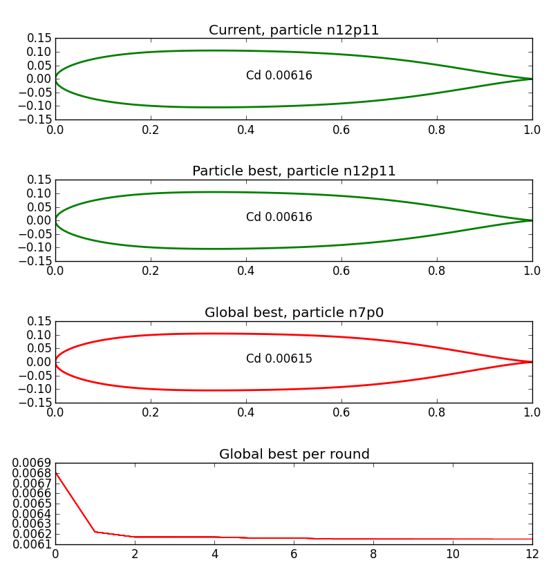

The Python XFOIL optimization toolbox can be used to optimize airfoils for a specific operating range. I initially made it to be able to optimize the shape of a strut.

## Useful because...
of its three different toolsets:
- `/xfoil` module: Communicates with XFOIL, makes it possible to retrieve polar data with just one function call.
- `/airfoil_generators`: Contains parametric airfoil generators which convert a list of numbers into an airfoil shape. Currently implemented:
  - NACA 4-series (for testing and fun)
  - PARSEC (is limited in the shapes it can produce but produces reasonable airfoil shapes, play around with it [here](http://www.as.dlr.de/hs/d.PARSEC/Parsec.html))
- `/optimization_algorithms`: An optimization algorithm tries to find a point in a multidimensional space with the lowest score (e.g. point (x,y) within 1<x<5 and 4<y<6, scored by calculating drag of NACAxy15 at alpha=0 and Re=1M). Currently implemented:
  - Particle Swarm Optimization: robust, easy-to-use, gradient-free optimization algorithm that often outperforms more complex algorithms.

## Airfoil generation and XFOIL communication
Being able to easily generate airfoils and communicate with XFOIL is very powerful. With not too much effort, you can make a plot like this:

[Go to code](example_naca4_drag.py)

## Particle Swarm Optimization
PSO is an optimization technique inspired by a flock of birds searching for food. It is relatively simple, doesn't concern itself with gradients, and often outperforms more complex techniques like genetic algorithms. See it working on the Rastrigin function [in this code example](example_pso_rastrigin_test).

It can easily be applied to airfoils, simply by translating the list of constrained numbers into an airfoil, then scoring the airfoil using the `xfoil` module to get lift, drag, moment or anything else at a specified Re and alpha or Cl. An attempt at optimizing a PARSEC airfoil shape for lowest drag at an angle of attack of 0 and a Reynolds number of 1 million, produces the following:

[Go to code](example_pso_drag_highRe.py)

## Additional development ideas
- NURBS airfoils: A great idea would be to add NURBS airfoils to the airfoil generators, as NURBS can define very smooth airfoils using very few parameters, so it's a good fit for optimization purposes. Ideally, its shape can be initialized by fitting it to some existing shape, to start off with a reasonable airfoil.
- Simulated Annealing optimization technique: Would be interesting to compare this technique with PSO.