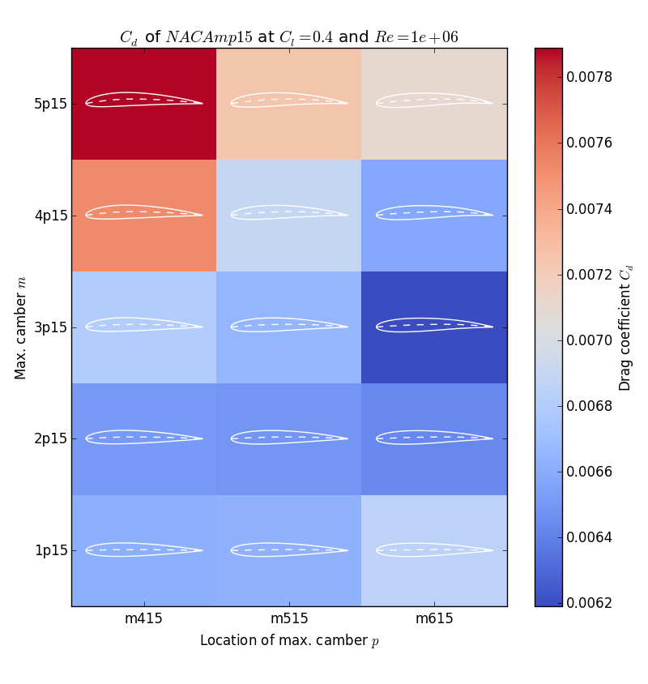

The Python XFOIL optimization toolbox can be used to optimize airfoils for a specific operating range. I made it to optimize the shape of a strut.

## Useful because
It might be useful to you for its three different toolsets:
- `/xfoil` module: communicates with XFOIL, makes it possible to retrieve polar data with just one function call.
- `/airfoil_generators`: to generate an airfoil's shape from a few parameters. Currently implemented:
  - NACA 4-series (for testing and fun)
  - PARSEC (very useful, play around with it [here](http://www.as.dlr.de/hs/d.PARSEC/Parsec.html))
- `/optimization_algorithms`: they basically consist of an array of constrained variables [a,b,c,...] that are converted into an airfoil by an airfoil generator, then scored by XFOIL. The algorithm tries to find the best score. Currently implemented:
  - **Not yet implemented, working on it** Particle Swarm Optimization: robust, easy-to-use optimization algorithm that often outperforms genetic algorithms. Does not use gradients.

## Airfoil generation and XFOIL communication
Being able to easily generate airfoils and communicate with XFOIL is very powerful. With not too much effort, you can make a plot like in [this](example_naca4_drag.py) example:

## Particle Swarm Optimization
**PARSEC symmetric strut Particle Swarm Optimization example in the works.**

## Additional development ideas
- NURBS airfoils: A great idea would be to add NURBS airfoils to the airfoil generators, as NURBS can define very smooth airfoils using very few parameters, so it is very good for optimization purposes. Ideally, the NURBS airfoil can be fitted to some other shape, to start off with a reasonable airfoil.